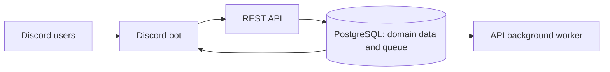

# Infrastructure

Detailed guide to the infrastructure services that power Genji Shimada.

## Architecture Overview



The bot's direct database login can access queue storage only. Domain access goes through the API.

## PostgreSQL

### Overview

PostgreSQL 17 is the primary data store for all persistent data.

### Schema Organization

The database uses multiple schemas for logical separation:

```
genjishimada (database)
├── core              # Users, maps, permissions
├── maps              # Map metadata, ratings
├── completions       # User completion records
├── playtests         # Map playtesting data
├── users             # Profiles, XP, rank cards
├── lootbox           # Lootbox system
├── rank_card         # Rank card customization
└── public            # Jobs, sessions, idempotency
```

### Backups

Create a full backup:

```bash
pg_dump -U genjishimada -h localhost -p 65432 genjishimada > backup_$(date +%Y%m%d).sql
```

## PostgreSQL background queue

PGQueuer 1.1.1 stores accepted work in the existing PostgreSQL instance. Workers run inside the API and bot; no separate service is needed. Business writes and their queued work commit together. Jobs retain public UUIDs, replay receipts, and failure history.

See [Queue operations](../services/queue.md) for retries, alerts, credentials, and automated verification.

## Cloudflare R2

### Overview

Cloudflare R2 is used for S3-compatible object storage.

**Use cases**:
- Completion videos and screenshots
- User rank card images
- Map thumbnails

### Configuration

Set environment variables:

```env
AWS_ACCESS_KEY_ID=your_key
AWS_SECRET_ACCESS_KEY=your_secret
R2_ACCOUNT_ID=your_account_id
```

### Bucket Details

The API uploads screenshots to the `genji-parkour-images` bucket and returns public URLs via the `cdn.bkan0n.com` domain.

## Sentry

### Overview

Sentry provides error tracking and performance monitoring.

### Configuration

Set the DSN in `.env`:

```env
SENTRY_DSN=https://your_key@sentry.io/your_project
```

### Integration

**API** (`apps/api/app.py`):
```python
import sentry_sdk

sentry_sdk.init(
    dsn=SENTRY_DSN,
    environment=APP_ENVIRONMENT,
    traces_sample_rate=0.1,
)
```

**Bot** (`apps/bot/main.py`):
```python
import sentry_sdk
from sentry_sdk.integrations.asyncio import AsyncioIntegration

sentry_sdk.init(
    dsn=SENTRY_DSN,
    environment=APP_ENVIRONMENT,
    integrations=[AsyncioIntegration()],
)
```

## Email (Resend)

### Overview

Resend is used for transactional email delivery.

### Configuration

```env
RESEND_API_KEY=your_resend_api_key
RESEND_FROM_EMAIL=noreply@genji.pk
```

## Next Steps

- [Docker Compose Guide](docker-compose.md) - Deploy these services
- [Reverse Proxy](reverse-proxy.md) - Caddy routing and TLS for Genji and monitoring
- [Bot Configuration](../bot/operations/configuration.md) - Configure the bot
- [API Documentation](../api/index.md) - Understand the API
