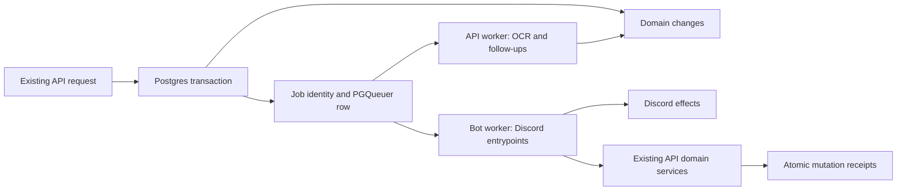

# Replace RabbitMQ with a PostgreSQL-backed queue

Date: 2026-10-02

Status: Approved for implementation on 2026-10-02

## Intent and approved constraints

Remove RabbitMQ completely from Genji Shimada. Use the existing PostgreSQL instance to retain background work across API, bot, database, and VPS restarts. Reduce the number of running infrastructure services and eliminate RabbitMQ queue declaration, connection-pool, and DLQ administration.

The user approved PGQueuer and a queue-only PostgreSQL login for the bot. Domain reads and mutations performed by the bot continue through the API. Workers run within the existing bot and API processes; this change adds no always-on service container.

This covers **every RabbitMQ producer and consumer in the codebase**, not only guides. It also covers completion OCR and linked-map follow-ups that currently exist only as in-memory tasks on paths feeding these queues.

**Preserve existing community-facing wording.** Do not introduce “Guide saved”, “already saved”, queue terminology, new confirmation messages, revised community Discord cards, changed notification copy, or new public error wording. Preserve commands, component labels, mentions, notification preferences, and message destinations. Reliability changes can alter whether an internal retry succeeds, but are not a community copy or interface redesign. The explicitly requested exception is the operator failure alert: retain its existing Discord destination and recipient, and add diagnostic information and persistent recovery controls.

Keep existing SDK response shapes and public job UUIDs. Internal worker interfaces may change. The bot's new database credential is restricted to queue storage, never domain tables or database administration.

Implementation and production deployment are separate actions. This specification authorizes neither deployment nor deletion of production broker volumes; it defines the cutover that must be prepared and reviewed against actual backlog data.

## Evidence and reference implementations

- `apps/api/services/base.py` creates `public.jobs` on a separate database connection and then publishes to RabbitMQ. It cannot commit the business write and the queued work atomically. Channel acquisition also occurs outside its publish-error handler, and some callers ignore a returned failed status.
- `apps/bot/extensions/_queue_registry.py` inserts a processed-message claim before executing the handler. A process kill leaves the claim behind; redelivery can then skip unfinished work. Deleting a claim after an exception also does not undo effects already performed by a handler.
- `apps/bot/utilities/base.py` reports job status through best-effort HTTP patches. Those patches can fail independently of delivery.
- `apps/api/routes/v3/maps.py:create_guide_endpoint` saves a guide before XP and newsfeed work. The bot's existing confirmation is not a confirmation of a committed API transaction. This design preserves that wording while making persistence and follow-up scheduling atomic.
- The tournament bridge has durable source rows, but its RabbitMQ publication and deferred XP announcements still cross database/broker boundaries.
- Completion OCR listeners and the linked-map newsfeed waiter are in-process tasks. A restart can remove these tasks before they enqueue their downstream work.
- Completion, playtest, and map-edit view restoration currently waits for RabbitMQ startup draining. Failed work can prevent unrelated persistent views from being restored.
- `apps/bot/extensions/rabbit.py` scans DLQs, posts to `channels.updates.dlq_alerts`, mentions the existing operator, and marks the broker message as notified. It provides no retry control. Preserve this operational notification when removing the DLQ processor. Completion OCR mismatch reports also use this channel; those existing reports retain their content and destination.

Sentry was inspected on 2026-10-02. The shutdown window at 06:42:23–06:44:00 UTC produced a connection reset and repeated connection-refusal reports across several layers; five groups each contained 88 events. [GENJISHIMADA-7V](https://bkan0n.sentry.io/issues/7767563978/) is one example.

[Guide feedback GENJISHIMADA-7W](https://bkan0n.sentry.io/feedback/?feedbackSlug=genjishimada%3A7768478084&project=4510687780864000) links to [GENJISHIMADA-5R](https://bkan0n.sentry.io/issues/7516258868/), a production `submit-guide` HTTP 409 at 15:52:32 UTC. The user described no visible result followed by an error on a second submission. This is consistent with an earlier guide insert, but neither the original delivery failure nor a causal connection to the shutdown was established. Do not label that incident a proven RabbitMQ failure or repair production data based on that assumption.

Reference implementations inspected:

- DoomPK: `core/doompk_core/queue.py` enqueues through the caller's asyncpg transaction; `bot/doompk_bot/utilities/queue.py` supervises PGQueuer, retries persistently, and holds terminal failures. Its lockfile selects PGQueuer 1.1.1.
- Jetpack Cat Racing: `api/api/outbox/` and `bot/bot/events.py` provide transactional delivery, leases, and Discord message bindings through API endpoints.

Use DoomPK's library integration and Jetpack Cat Racing's explicit treatment of partial external effects. Do not copy the latter's custom delivery engine alongside PGQueuer. PGQueuer's [reliability model](https://github.com/janbjorge/pgqueuer/blob/main/docs/guides/reliability.md) documents persistent retry, heartbeat recovery, held failures, and the need for replay-safe handlers. Its active-job deduplication is not permanent business idempotency.

## Complete queue inventory

Keep the existing routing names as PGQueuer entrypoint names, even where a historical name contains `api`. Shared msgspec domain payloads remain usable inside the new envelope.

| Existing event | Bot handler module | Replay requirement |
| --- | --- | --- |
| `api.completion.autoverification.failed` | `completions.py` | One failure notice per OCR decision and destination; manual-review scheduling must survive separately. |
| `api.completion.submission` | `completions.py` | Reuse the stored verification message; do not resurrect a superseded submission. |
| `api.completion.upvote` | `completions.py` | Refresh the latest count; deduplicate any milestone forward separately. |
| `api.completion.verification` | `completions.py` | Checkpoint publication, XP, world-record rewards, mastery, notifications, and cleanup independently. |
| `api.completion.verification.delete` | `completions.py` | Deleting an already absent message succeeds. |
| `api.map_edit.created` | `moderator.py` | Reuse the stored moderation message. |
| `api.map_edit.resolved` | `moderator.py` | Repeat cleanup safely; do not create another moderation message. |
| `api.newsfeed.create` | `newsfeed.py` | Bind sends by newsfeed event and destination; checkpoint thread/view refresh separately. |
| `api.notification.delivery` | `notifications.py` | Track each destination independently; do not redeliver successful destinations. |
| `api.playtest.create` | `playtest.py` | Reuse the created thread/message and resume remaining initialization. |
| `api.playtest.vote.cast` | `playtest.py` | Render current votes; avoid replaying a stale count. |
| `api.playtest.vote.remove` | `playtest.py` | Render current votes; avoid replaying a stale count. |
| `api.playtest.approve` | `playtest.py` | Guard domain mutations and checkpoint Discord changes and announcements. |
| `api.playtest.force_accept` | `playtest.py` | Guard domain mutations and checkpoint Discord changes and announcements. |
| `api.playtest.force_deny` | `playtest.py` | Repeat closure safely; deduplicate notices. |
| `api.playtest.reset` | `playtest.py` | Identify the reset generation; do not apply an old reset to a newer playtest. |
| `api.tournament.completion.created` | `tournaments.py` | Persist and reuse the moderation message binding. |
| `api.tournament.verification.changed` | `tournaments.py` | Preserve the existing log-only acknowledgement; add no Discord verdict message. |
| `api.tournament.rollover` | `tournaments.py` | Preserve start/end/reroll identities; reconcile champion roles and bind the announcement. |
| `api.tournament.results` | `tournaments.py` | Preserve deferred-results behavior; checkpoint roles and bind the separate results card. |
| `api.xp.grant` | `xp.py` | Deduplicate rank/prestige keys and notifications as well as message sends and role changes. |

`infra/rabbitmq/definitions.json` additionally contains obsolete `api.tournament.cycle_started` and `api.tournament.cycle_completed` queues, including their DLQs. They are not active consumer contracts. Inventory and reconcile any messages in these queues during cutover rather than recreating obsolete consumers or silently discarding the messages. Runtime-created queues such as rollover/results must be inventoried from the broker as well as the checked-in definitions.

Add three API-owned entrypoints: `completion.ocr.requested`, `tournament.ocr.requested`, and `map.linked.newsfeed.requested`. These are durable continuations of the approved submission workflows.

## Architecture and ownership

- **Shared SDK:** a transport-neutral `JobEnvelope` and `JobContext`, payload versions, and event-name ownership. Do not expose aio-pika types or a PGQueuer job object to domain handlers.
- **API queue repository:** transactional enqueue, durable event identity, UUID-to-PGQueuer-ID mapping, status lookup, retention, and operational inspection.
- **API services:** own domain transaction boundaries, business idempotency, and downstream enqueueing. An enqueue failure rolls back its associated mutation instead of returning a misleading success or a detached failed job.
- **Bot worker:** supervises the queue connection, registers all Discord entrypoints, decodes envelopes, applies the common retry policy, and invokes existing handlers with a `JobContext`.
- **API worker:** runs the three API-owned entrypoints with fresh service instances/connections, independent of the HTTP request that created the job.
- **Effect services:** persist Discord bindings and transactional API mutation receipts. These record application effects; they do not duplicate PGQueuer claiming, heartbeat, or retry state.
- **Bot alert supervisor:** independently reconciles durable failure alerts through the API and manages their persistent Discord recovery controls. A failed job must not depend on its own queue handler working in order to notify the operator.

Start both workers with global processing concurrency two, batch size one, and a per-entrypoint concurrency limit of one. These settings meet PGQueuer 1.1.1's requirement that `max_concurrent_tasks` be at least twice `batch_size`. They are conservative defaults for the VPS and Discord rate limits; correctness must still hold when two processes overlap during restart. Do not assume that one configured worker guarantees exactly-once execution.

Use PGQueuer 1.1.1, matching the inspected DoomPK lockfile, pinned in the resolved dependency lock. Use its installed interfaces when implementing; do not assume newer documentation features such as `enqueue(on_conflict="skip")` exist in that version. Check in the corresponding schema as a normal forward migration. Runtime worker logins do not install or upgrade schema. A library upgrade later requires a reviewed schema upgrade and compatibility tests.

## Database model and enqueue contract

Use PGQueuer's standard queue, log, statistics, and schema metadata tables. Keep `public.jobs` as the existing public UUID identity and retained status summary, adding:

- `queue_job_id bigint`, unique when present; it is a logical reference, not a foreign key to an active row that PGQueuer removes after success.
- `event_key text` and a unique `(action, event_key)` identity for new jobs. Legacy records can have a null key.
- `payload_hash text` and `schema_version integer` to detect conflicting reuse of an event identity.
- `entity_key text` and a monotonic event sequence for ordering and stale-event checks.
- `handler_failures integer` for the ordinary failure budget, independent of transport retries caused by outages or unmet dependencies.
- `retry_generation integer NOT NULL DEFAULT 0`, incremented atomically on an accepted operator retry. Automatic attempts share a generation; an old failure alert cannot authorize retrying a later failure episode.
- `depends_on uuid` when a continuation requires another application's job to complete.

The envelope contains the public UUID, event identity, payload version, and domain payload. Persist only an allowlist of tracing metadata. Existing code forwards whole HTTP headers; the replacement must not store authorization headers, cookies, or other request credentials in queue payloads or logs.

Expose `enqueue_job(conn, *, event_name, payload, event_key, entity_key, depends_on=None) -> JobStatusResponse`. The caller supplies an active transaction. The helper creates/resolves the durable job identity, inserts the PGQueuer row using `Queries.from_asyncpg_connection(conn)`, and saves its returned numeric ID within that same transaction. It never acquires a separate connection or commits for the caller.

Concurrent enqueue attempts for the same `(action, event_key)` resolve to the same public job and return its existing status. A differing payload hash is an invariant violation, not a reason to overwrite the job or silently skip it. Domain operations with no existing transaction acquire one at their service boundary. Never leave the queue mapping and queued row partially committed.

Event keys distinguish business operations:

- Existing immutable source IDs identify creation/announcement jobs.
- XP and other repeatable grants use a persisted grant/operation identity, not merely `(user, reward type)`.
- Verification, reset, and other repeatable state changes get a new persisted transition identity for each actual transition. Approve → reject → approve must produce distinct legitimate work.
- Tournament start, end, results, and reroll identities remain distinct; preserve the existing `:start` separation.
- Replaying a failed job preserves its original event identity and effect keys.

PGQueuer's own dedupe key is a second guard while work is active. The durable identity in `public.jobs` remains authoritative after the active queue row is removed or held.

## Transaction boundaries and durable continuations

Audit **every** call to the old publisher, including calls through shared newsfeed, notification, XP, store, and tournament helpers. Replace publication with enqueue on the transaction containing the mutation that requires it. An empty search for direct `publish_message` calls is insufficient if a helper still performs an independent commit.

### Guides

Move orchestration from the route into a service transaction: map/user validation as necessary, guide insert, applicable XP mutation, newsfeed insert, and all resulting queue inserts. Keep external Discord/HTTP work outside the database transaction.

For an existing guide with the same user, map, and submitted URL, return the existing `GuideResponse` through the normal successful path, with no second XP grant, newsfeed event, or queue job. Use the application's existing URL treatment rather than adding a new normalization policy. An existing guide with a different URL retains the existing conflict contract and wording. A deleted guide later recreated is a new operation; a global forever-key based solely on user/map/URL must not suppress it.

The bot retains its current confirmation and response wording. Add no “saved” or “already saved” message and do not change the appearance of the confirmation flow. Transport idempotency and transactional persistence provide the reliability improvement.

### Completions and OCR

Persist the completion, tournament linkage where applicable, replacement cleanup, and either the OCR job or manual-review job in one transaction. The worker loads current state before doing OCR so a superseded or already-resolved submission is not verified again.

OCR HTTP requests run outside transactions with bounded timeouts. On a match, apply the existing verification logic and enqueue downstream effects atomically. On a mismatch or OCR service error, preserve the existing manual-review fallback and existing notification text, but persist the fallback decision and jobs atomically. Infrastructure failure while committing a decision retries the durable job; it must not be swallowed as completed work.

Use the same rule for tournament-only non-PB OCR. Retrying a decision must not create duplicate verification cards, failure notices, rewards, or notifications.

### Linked maps

Replace `asyncio.create_task(_wait_and_publish_linked_map_newsfeed(...))` with `map.linked.newsfeed.requested`. Persist the link and its continuation together. When a new playtest must exist first, record the parent job UUID in `depends_on`.

The continuation checks durable dependency status. Pending/processing/retrying parents defer it without occupying a sleeping handler. A successful parent allows it to resolve the actual playtest ID and atomically create the newsfeed job. A terminally failed parent holds the continuation with a dependency error. Requeueing the parent allows this continuation to resume automatically when the parent succeeds; it does not require the user to resubmit the link.

### Tournaments, rewards, notifications, and newsfeed

Keep `tournaments.pending_transitions` as the durable handoff from tournament scheduling/business rules. Replace the RabbitMQ bridge with a database-to-database transaction: rewards, PGQueuer enqueue, XP notification enqueue, and source-row acknowledgement either all commit or all roll back. Remove post-commit `pending_xp_events` publication in favor of enqueueing through the same connection. Preserve existing tournament reward ledgers and start/end/result semantics.

Notification creation and delivery enqueue commit together. Newsfeed insertion and its delivery enqueue commit together. A bot handler that invokes either API operation must pass a stable effect identity so replay cannot create a new domain notification/newsfeed row each time.

## Replay safety and external effects

Remove the old global “claim before handler” check from new consumers. Do not use `public.processed_messages` as proof that a legacy effect completed; its contents are ambiguous after a crash. Retain it for migration reconciliation until the cutover audit is complete.

Provide API-owned effect receipts keyed by `(job_id, effect_key)`, with a request fingerprint and persisted result. For a database mutation, checking/creating the receipt, performing the mutation, recording its result, and enqueueing downstream work share one transaction. A concurrent duplicate waits for the transaction and then receives the recorded result. A rollback leaves no successful receipt. There is no separately committed “claimed” row that can suppress unfinished domain work.

The bot supplies job context through its authenticated API client. Mutating endpoints that accept it validate allowed effect names and compatible originating job actions. For a new effect they also validate the active queue claim, using the worker-manager UUID and claim timestamp carried in the context; this check and the effect mutation share a short transaction that locks the queue row. A completed receipt may be read back after the original claim expires, but an expired owner cannot start a new mutation. Normal clients keep their existing contracts. The worker login does not gain direct access to domain receipts or domain tables.

Apply this to all additive or creation effects reached by handlers, including:

- Completion, record, world-record, and guide XP; preserve current eligibility rules and award amounts.
- Rank-up and prestige lootbox keys, including each item in multi-key grants.
- Notifications, newsfeed entries, mastery changes, and moderation-side domain mutations.
- Tournament effects, keeping existing domain ledgers as the final business guards.

Create API-managed Discord effect bindings keyed by job/effect/destination, including channel, message or thread ID, progress state, and timestamps. Reuse existing domain message-ID columns and mirror new bindings atomically where a domain column is required. A handler resumes each incomplete step instead of repeating the whole workflow's successful effects.

For edits/deletes/role changes, reconcile current state. A missing object during deletion is success; a missing object needed for creation/edit follows that handler's existing recovery behavior. Notification delivery records success/skipped/permanent failure per destination; a closed-DM permission failure must not retry the whole notification or duplicate a successful channel delivery. Temporary HTTP/network failures remain retryable.

For sends, record an intended effect before sending, then persist the returned message ID before proceeding. On retry:

1. A recorded message ID is reused; subsequent steps continue.
2. An effect that never began can be sent.
3. An interrupted send without a recorded ID is uncertain. Reconcile using an existing domain binding or unambiguous evidence from the destination. Do not add visible markers or change community message content to aid reconciliation. If existence cannot be established safely, retain the job for targeted inspection rather than blindly sending again or declaring it complete. Operator failure alerts are the requested exception: their displayed job UUID and generation can identify the alert during recovery.

There is no exactly-once guarantee across PostgreSQL and Discord. Durable database receipts prevent duplicate domain mutations; Discord binding/reconciliation limits duplicates while making ambiguous outcomes explicit. This exceptional held state must identify the job, effect, destination, and last known stage so recovery is more concrete than moving opaque messages through DLQs.

Use persisted entity/transition identities to guard stale state. Jobs affecting the same completion/playtest lifecycle defer behind earlier unfinished work for that entity, and handlers re-read the current domain state before applying an old transition. Read-model refresh jobs such as vote counts may reconcile directly to current state. Explicit dependencies handle creation-before-follow-up ordering. Unrelated entities continue processing; a held job does not block all startup or all queues. Role handlers reconcile current authoritative membership/rank/champion state so an old retry cannot revert a newer result.

## Worker lifecycle and failure policy

Register each entrypoint with one process owner, bot or API. Startup rejects duplicate registrations and unknown producer event names. Malformed/unsupported payload versions are held with a clear diagnostic; they do not terminate the worker loop or prevent unrelated jobs from running.

Defaults:

| Setting | Default |
| --- | --- |
| Bot active jobs | 2 |
| API active jobs | 2 |
| Batch size / per-entrypoint concurrency | 1 / 1 |
| Queue polling fallback | 5 seconds |
| Stale worker heartbeat threshold | 60 seconds |
| Graceful job drain | 30 seconds |
| Container stop grace | 45 seconds |
| Reconnect backoff | 1 second doubling to 30 seconds, with jitter |
| Queue database command timeout | 10 seconds, configurable through `QueueWorker.command_timeout_seconds` |
| Ordinary handler retry delays | 5s, 15s, 1m, 5m, 15m; then hold |
| Default handler timeout | 120 seconds, configurable for existing longer handlers |

Treat these as explicit initial settings, not library defaults. PGQueuer remains responsible for heartbeat/reclaim and durable scheduling. A small policy executor classifies errors and requests persistent retries; do not build another leasing engine.

The queue database deadline includes waiting for the shared driver connection. A timed-out command closes that connection and cancels its executions for recovery, without charging database contention to the handler failure budget. This prevents a blocked heartbeat or status write from indefinitely stalling unrelated work or shutdown.

Expected database/API/Discord-wide outages do not consume the ordinary handler failure budget. Stop claiming when a required dependency is unavailable, reconnect with backoff, and persist a deferred retry if an already-started job encounters an outage. PGQueuer may increment its transport attempt counter on such deferral; store the bounded handler-failure count separately in queue job metadata so a long outage does not turn the entire backlog into terminal failures. Rate limits honor retry-after. Authentication/configuration failures are actionable operational errors, not an endless rapid reconnect loop.

On graceful shutdown, stop polling/claiming first, maintain heartbeats during the bounded drain, then cancel remaining handlers and close the queue connection before API/Discord transports. Cancellation and forced termination must leave unfinished work recoverable rather than completing or permanently failing it.

The inspected PGQueuer 1.1.1 source catches `CancelledError` in `QueueManager._dispatch` and logs `canceled`; its default terminal-log SQL removes canceled jobs from the active table. Therefore, passing ordinary shutdown cancellation through unchanged is forbidden. The policy executor translates lifecycle interruption into durable retry when it can, and a small persistence adapter treats any remaining lifecycle `canceled` result as recoverable. If the database is available, it returns the owned job to queued state; otherwise it leaves the picked row for stale-heartbeat recovery. Only an explicit audited operator discard is terminal cancellation. Do not call the library's cancel-job API as a way to shut down a service.

The same adapter fences completion, held-failure, retry, and heartbeat writes by queue job ID, `queue_manager_id`, and the `updated` timestamp captured when that execution was claimed. The pinned library's default terminal SQL matches by job ID alone, so it is insufficient for an old worker that resumes after a replacement has claimed the job. Under the adapter, a zero-row update means ownership was lost: stop that execution and do not write a terminal success/failure for the newer owner. Persist paired queue/log changes in one transaction. This adapter changes ownership checks and lifecycle cancellation handling; PGQueuer still selects/claims work, schedules it, and detects stale heartbeats. Cover these version-specific integration points with focused tests before relying on them in production.

On database connection loss, cancel affected executions and rebuild the worker connection/manager. Do not let a disconnected old handler continue launching effects while a replacement worker reclaims the job. API mutation receipts remain the final guard against overlapping executions. Workers are supervised tasks; an unrecoverable task death is visible and causes a controlled process restart rather than a healthy-looking bot that no longer consumes work.

Restore Discord persistent views from database state when API and Discord readiness allow it. Skip records that do not yet have a real message ID, and let successful creation handlers register their new views. Restoration and creation must deduplicate registrations and reconcile concurrent resolution. Do not wait for the entire startup backlog to drain.

## Job status, inspection, and retention

Keep `GET /api/v3/internal/jobs/{job_id}` and the existing `JobStatusResponse` fields. Map the queue's current state as follows:

| Durable queue state | Existing API status |
| --- | --- |
| Ready or delayed retry | `queued` |
| Claimed/running, including waiting for stale-heartbeat recovery | `processing` |
| Completed successfully | `succeeded` |
| Held failure or explicitly canceled/discarded job | `failed` |
| Legacy timeout, or an explicitly terminal job deadline | `timeout` |

The active row takes precedence over past failure logs after requeue. Once the active row is gone, use its terminal log/retained summary. A retrying job must not be reported as terminally failed. Missing/inconsistent metadata is an internal error requiring reconciliation, never synthesized success. Remove the bot's best-effort `_wrap_job_status` patches for new jobs. Update the linked-map status reader and all other direct readers to use the same status repository. Legacy job records retain their recorded status.

Public UUIDs, event identities, and compact final summaries are retained. Keep detailed completed-job logs for 30 days. Before removing terminal logs, persist the terminal summary on the corresponding `public.jobs` row in the same maintenance transaction. Never prune active, retrying, held, uncertain, or dependency-blocked work. Keep replay receipts/bindings for as long as the associated job can be replayed; do not prune them on an independent shorter timer.

Provide operator commands to list pending/running/retrying/held work, inspect a job's last error and effect progress, and retry selected job IDs. Commands and Discord controls use the same authoritative recovery service; do not make raw PGQueuer requeue operations a parallel routine recovery path that bypasses authorization, receipts, or audit history. Retrying preserves identities and successful receipts, resets the bounded failure budget, and does not create a new business event. Uncertain-send resolution explicitly records either the located message ID or an audited decision to resend. Discard requires a reason and is never the default. No public dashboard or community-facing job terminology is added.

Report queue depth, oldest ready-job age, held/uncertain counts, and worker liveness. Expected shutdown cancellation is not an error. Log dependency outage/recovery transitions without per-second exception storms; emit one grouped actionable Sentry issue for a sustained outage or terminal job failure, with sanitized job/event identifiers. Exclude credentials and complete request headers.

## Discord failure alerts and recovery controls

Keep operational failure alerts in the existing configured Discord channel, mentioning the existing recipient (`141372217677053952`). Move the hardcoded recipient to configuration while preserving this default. Rename the internal channel setting from `dlq_alerts` to `job_alerts` in both environment configurations and every caller, retaining the existing channel IDs. Existing OCR mismatch reports continue to use that channel with unchanged wording; a mismatch is not itself a failed queue job.

Notify when either a bot-owned or API-owned job is held and needs intervention, including unsupported payloads, exhausted ordinary retries, unresolved Discord sends, and terminal dependency failures. Routine automatic retries and expected shutdown cancellation do not ping the operator. Retain one main alert card per logical job and update it as the job changes. A new terminal failure following an operator retry is a new notification episode: update the main card and send one short reply mentioning the operator, with the job UUID and generation. Do not rely on a card edit to deliver a fresh notification. Persist each reply binding by `(job_id, retry_generation)`; ordinary status edits do not repeat the mention.

The operator card shows the event name, public job UUID, retry generation, concise sanitized error, attempt count, failure time, completed/pending effects, and a Sentry link when available. It has a **Retry job** button and a **Details** button for an ephemeral current diagnostic. Never dump raw credentials, HTTP headers, or an unrestricted payload into the channel. Restrict allowed mentions to the configured alert recipient so payload/error text cannot ping other users or roles. Set `allowed_mentions` explicitly on both sends and edits, following Discord's [message API](https://github.com/discord/discord-api-docs/blob/main/developers/resources/message.mdx).

Use `discord.ui.DynamicItem` for the action buttons and a view with `timeout=None`, following the existing dynamic-item patterns in completions and change requests. Register the dynamic classes during bot startup, independently of queue draining. Use compact, versioned custom IDs such as `job:retry:v1:{job_uuid}:{retry_generation}`. Reconstruction only parses the ID; the callback defers promptly and reads current state through the API. It does not rely on the original in-memory view or trust the state shown on an old card. This makes buttons on previously posted messages usable after a restart. See the official [DynamicItem API](https://discordpy.readthedocs.io/en/stable/interactions/api.html#discord.ui.DynamicItem) and [dynamic item registration](https://discordpy.readthedocs.io/en/stable/ext/commands/api.html#discord.ext.commands.Bot.add_dynamic_items).

Restrict recovery controls and detailed diagnostics to an explicit `QUEUE_OPERATOR_IDS` allowlist, initially containing only the existing alert recipient. Validate the actor both in the bot callback and in the API recovery service. Channel access, a generic moderator role, or a forged custom ID is insufficient. Require the trusted bot API credential with the `jobs:manage` scope for recovery endpoints, in addition to the actor check; authenticated superuser credentials retain the existing scope behavior but do not bypass the actor check. The bot reports the actual Discord interaction actor, not a user ID supplied in the custom ID. Discord-originated requests also validate the configured guild, channel, and stored alert message binding. The queue-only database credential gains no access to job metadata, alert records, or recovery administration.

`POST /api/v3/internal/jobs/{job_id}/retry` accepts the expected generation, an idempotency key (the Discord interaction ID for button requests), and authenticated operator context. In one transaction, lock the job and queue state, validate authorization and the current held state, check that uncertain effects have been resolved, record the audit action, increment `retry_generation`, reset the ordinary failure budget, and requeue the existing held row. Preserve the public UUID, queue ID, event identity, original payload, and every successful effect receipt/binding. No new business submission is created. The action resumes incomplete work after the operator has diagnosed and fixed its cause; it does not rerun completed XP grants or message sends.

Duplicate interaction requests return the recorded result. Concurrent clicks, old generations, and queued/running/succeeded/discarded jobs cannot produce another requeue. Return typed outcomes so the bot can explain an already-running, stale, completed, or reconciliation-required result ephemerally. Unknown/missing queue state requires inspection, not reconstruction from the button. An unresolved send keeps **Retry job** disabled until its explicit reconciliation is recorded; **Details** explains what needs resolution. The same checks still run server-side even if the button appears enabled.

After acceptance, update the existing alert to queued, disable retry while queued/running, and eventually show succeeded or the new failure with its current-generation button. A Discord edit failure never rolls back an accepted retry or falsely reports that it was rejected. The durable projection catches up later. If the API response is lost, resolve the action using its idempotency key/current state instead of assuming failure and creating another operation. Confirmed success permanently disables retry for that job.

Persist API-owned alert records keyed by public job UUID, with the Discord guild/channel/message binding, desired render version, and per-generation notification progress. Retain the action audit and bindings for as long as the job is actionable. A supervised bot task polls an authenticated API alert endpoint every 15 seconds; the API reconciles held queue state into durable alert records idempotently, including failures recorded while the API was unavailable. Capture the job's current generation under the same row lock used by recovery operations so a stale failure observation cannot become a new alert episode. Completed-job summaries retain enough state to update outstanding alerts after queue/log cleanup.

Alert delivery is independent of ordinary work queues and reuses the effect-binding state transitions to coordinate overlapping bot processes. Its API binding operations authorize the trusted `jobs:manage` service identity and alert record, not an active execution claim on the failed job; otherwise a held job could never be reported. A failure to deliver an alert does not enqueue another failure alert about itself. Back off during API/Discord outages and catch up after recovery or restart; do not mark an episode notified before delivery. If an alert or notification reply succeeds but its message ID is not recorded, reconcile using its job UUID/generation in the destination before creating a replacement. A confirmed deleted alert can be recreated; inaccessible or ambiguous history is not proof of deletion. Notification and render progress remain durable, with Sentry/log visibility when Discord delivery is unavailable.

## Database role and deployment changes

Create a dedicated `genjishimada_queue_worker` role with a deployment-provided secret, no hardcoded production password, no superuser/role/database-creation powers, and no schema ownership. Grant queue-table SELECT/UPDATE/DELETE, queue-log INSERT and required log-sequence usage, and read access to queue metadata/statistics/schedule tables needed by PGQueuer startup. No job INSERT or schema-install privileges are needed by the bot consumer. Queue metadata such as failure budgets and dependency status is exposed through authenticated internal API operations; the bot does not update `public.jobs` directly. Domain access remains denied, including access inherited through `PUBLIC`. The API's existing database identity owns domain work and migrations.

Configure the bot with `QUEUE_DATABASE_URL` on the existing internal Docker network. Give the API worker its own queue connection within the API process and reuse service pools for short business transactions. Do not hold a business transaction while calling Discord, OCR, or another HTTP endpoint. Verify migrations and least-privilege startup in both a fresh database and an upgraded database.

Configure matching `QUEUE_OPERATOR_IDS` in the API and bot, preserve the current alert recipient/channel in bot configuration, and provision `jobs:manage` for the trusted bot credential. Recovery endpoints and the alert polling/binding endpoints remain API operations, not extra privileges for the bot's queue login. Document recovery commands, Discord controls, uncertain-send resolution, and notification recovery in the operations runbook.

Remove all active RabbitMQ integration:

- Replace API publisher/lifespan connections and bot `RabbitHandler`, its pools, startup draining, and DLQ processor.
- Replace aio-pika handler arguments and transport imports throughout bot utilities and all extensions; use transport-neutral context.
- Remove `aio-pika` and resulting unused `aiormq` dependencies from both application manifests and the resolved lockfile.
- Remove RabbitMQ services, health checks, dependencies, broker volume declarations, and environment references from local/dev/prod Compose files.
- Remove `infra/rabbitmq/`, including queue definitions, initialization, OAuth management, and broker image files, from the final runtime configuration.
- Update both deployment workflows, environment examples, task-runner comments/commands, and setup/operations/architecture documentation. Replace the RabbitMQ service documentation and navigation entries with queue operations documentation.
- Remove RabbitMQ-specific test mocks and obsolete DLQ tests, replacing them with meaningful queue/recovery coverage.
- Update current source/doc comments, SDK documentation, generated OpenAPI descriptions where affected, README/CONTRIBUTING/SECURITY, and repository architecture guidance. Historical migrations and archived planning records may mention RabbitMQ as history; do not rewrite already-applied migration files.
- Inventory RabbitMQ reverse-proxy routes, OAuth clients, remote secrets, and any external consumers as deployment cleanup items. Remove only broker-specific resources after checking they are not shared. Repository edits do not imply that remote resources have already been removed.

## Cutover and rollback

Use a coordinated maintenance cutover instead of dual-writing to two transports.

1. Apply additive PostgreSQL schema and credential preparation while the existing stack is still operational. Take the normal database backup and preserve the RabbitMQ volume.
2. Pause new mutation traffic and all producers, including the tournament poller and relevant scheduled producers. Drain ordinary RabbitMQ work with the old consumer while dependencies are healthy, then stop the old consumer. Record outstanding unacknowledged work and let it return to a stable broker queue before export.
3. Inventory every runtime queue and DLQ, including the obsolete tournament names. Export any remaining payloads and metadata to a durable migration manifest. Track each source message, its event identity, and its disposition. Import only supported, still-required work; reconcile jobs against domain rows, actual Discord bindings, legacy claims, and existing completion evidence. Unknown legacy payloads remain preserved for explicit reconciliation.
4. Import eligible work transactionally using an import identity so rerunning the import cannot duplicate jobs. Preserve original public job UUIDs when valid and resolve multiple old transport copies to one logical event. Never treat a processed-message claim alone as proof of success.
5. Start the new API/bot workers, verify entrypoint registration, credentials, job status, worker recovery, and representative API flows, then resume writes and scheduled producers. Preserve alert visibility for imported held jobs. The old consumers remain stopped.
6. Stop/remove the RabbitMQ service to release its RAM. Keep its volume and export until every outstanding item has an audited disposition and the new system is verified. Volume deletion is a later explicit cleanup action.

Before writes resume, rollback can restore the old application/consumer configuration using the preserved broker state, with imported jobs disabled to prevent double processing. After new PostgreSQL work or imported work has run, rollback requires reconciliation/export of new work and its completed effects; simply starting the old consumers would be unsafe. Document this boundary in the runbook. No automatic rollback discards queue data or replays already-completed Discord effects.

The migration cannot reconstruct historically lost messages from `public.jobs` alone because it does not currently store their payloads. Reconciliation uses retained broker messages and domain evidence, and records unrecoverable items explicitly. No unsupported claim is made that this migration repairs every past incident.

## Verification and acceptance

**Automated backend coverage is part of the deliverable.** The scenarios below are executable regression requirements, not a manual UAT checklist. The replacement is incomplete until their tests exist and pass in CI. This specification describes required new coverage; it does not claim these tests have already been implemented or run. Per the user's instruction, do not add Discord-specific tests: no message rendering, mentions, UI snapshots, component callbacks, dynamic-item reconstruction, gateway simulation, or live Discord tests. Test the underlying queue/recovery service and database guarantees directly. The Discord feature requirements remain in scope, but they are not part of this automated acceptance matrix.

The current suite provides useful foundations but does not verify the proposed behavior:

- `apps/api/tests/bot/test_rabbit_dlq_sweep.py` verifies isolation between DLQ sweep failures with `_process_one_dlq` replaced by a mock. It does not prove durable job recovery.
- `apps/api/tests/integration/test_jobs_integration.py` verifies current job status/authentication contracts using real PostgreSQL, but not PGQueuer claims, crash recovery, or operator retry.
- `apps/api/tests/bot/test_tournaments_handler.py` covers some duplicate-claim handling with a mocked API. The outbox tests in `apps/api/tests/repository/tournaments/test_outbox_poller.py` replace publication with a recorder. Neither proves transactional queue delivery or safe replay after a process kill.
- Existing API fixtures send `X-PYTEST-ENABLED`, which currently skips publication. The current CI workflow runs `apps/api` with testmon; it does not guarantee a full recovery run on every change.

Use real PostgreSQL for queue semantics and transaction tests. The existing `X-PYTEST-ENABLED` publish bypass must not hide the new enqueue path: test databases should persist real queue rows. Replace external effects with a simple transport-independent recorder at the application boundary; it can complete, fail, or leave an uncertain result without simulating Discord. Keep external effects disabled by test configuration, not by accepting a request header that reports a nonexistent job as succeeded.

Each acceptance ID below must map to collected test cases and their results. Test names or parameter IDs carry the acceptance ID so a failing CI result identifies the behavior that regressed. The suite names identify the required coverage groups described after the table.

| ID | Scenario | Required outcome | Automated suite |
| --- | --- | --- | --- |
| Q01 | Business transaction rolls back | No domain write, public job identity, effect receipt, or PGQueuer row survives. | Transactions |
| Q02 | Queue insertion fails | Related domain changes roll back; no false successful submission. | Transactions |
| Q03 | Bot offline during submission | Domain write and delivery work commit; delivery occurs after restart. | Transactions, lifecycle |
| Q04 | API killed after accepting an OCR submission | OCR/manual-review work remains and resumes. | Lifecycle |
| Q05 | Worker killed before effects, midway through effects, and after an effect but before queue completion | Recovery resumes work; completed database mutations are not repeated. | Lifecycle, effects |
| Q06 | Graceful stop exceeds drain timeout | Cancellation leaves unfinished jobs recoverable and resources close in order. | Lifecycle |
| Q07 | PostgreSQL disconnect/restart and API outage | Worker reconnects; accepted work remains; maintenance does not exhaust ordinary retries. | Lifecycle |
| Q08 | Two consumers overlap or an old worker resumes | No duplicate XP/key grants; stale work cannot overwrite later domain state or the newer queue claim. | Lifecycle, effects |
| Q09 | Verify → reject → verify, repeated reset/reroll | Distinct legitimate transitions are delivered; retransmission of the same transition is deduplicated. | Effects |
| Q10 | Completion/XP replay after partial success | XP, world-record guards, rank/prestige keys, mastery, newsfeed, and notification mutations run once per intended effect. | Effects |
| Q11 | External effect completes but its result cannot be persisted | Backend recovery retains an uncertain effect and requires reconciliation before repeating it. | Effects |
| Q12 | One notification destination succeeds and another fails | Successful destinations are not resent; failure classification is preserved. | Effects |
| Q13 | Poison/malformed payload or held dependency | Other jobs/entities continue processing. | Lifecycle |
| Q14 | Linked-map parent retries or is requeued | The continuation waits durably and resumes after successful dependency completion. | Transactions, lifecycle |
| Q15 | Fresh/upgraded schema with worker credentials | PGQueuer starts, consumes, retries, and logs; domain access and schema creation are denied. | Schema and operations |
| Q16 | Existing job endpoint and retained history | UUID/status contract remains valid during retries, requeue, completion, and log pruning. | Recovery API |
| Q17 | Bot-owned or API-owned job exhausts ordinary retries | Held state, failure generation, error summary, and attempt budget are persisted and inspectable; automatic retries do not create new logical jobs. | Recovery API, lifecycle |
| Q18 | API unavailable when a worker records a failure | The recovered API reads the durable failure correctly without depending on a lost status patch. | Recovery API, lifecycle |
| Q19 | Services restart before an operator requests retry | Retrying through the API with the saved job UUID/generation resumes the same job and preserves completed effects. | Recovery API, lifecycle |
| Q20 | Duplicate/concurrent retry requests or lost retry response | Exactly one audited requeue occurs; subsequent requests resolve its durable result. | Recovery API |
| Q21 | Unauthorized actor/scope, invalid operation context, stale generation, or already successful job | Retry is rejected without a queue/domain mutation. | Recovery API |
| Q22 | Job has an unresolved external effect | The API exposes the uncertain state and refuses retry until explicit reconciliation is recorded. | Recovery API |
| Q23 | Requester disconnects after retry commits | The accepted job proceeds independently of the requester and exposes its correct status through a subsequent API read. | Recovery API |
| Q24 | Retried job fails again | The new failure remains inspectable under its new generation; a stale retry request cannot act on it. | Recovery API |
| Q25 | Guide request succeeds or is retried with the same URL | One guide/XP/newsfeed result; existing API response shape and conflict contract remain. | Transactions, effects |
| Q26 | Registry/producer inventory | All 21 active RabbitMQ event types plus the three approved API continuations have exactly one owner and compatible payload contracts. | Contracts |
| Q27 | Import is rerun | No duplicate imported logical job; every source message has an explicit disposition. | Schema and operations |
| Q28 | Broker absent | API, bot, tests, and local/dev/prod configuration work without RabbitMQ, aio-pika, or broker credentials. | Contracts, schema and operations |

### Automated suites and test harness

Add queue integration coverage under `apps/api/tests/integration/queue/` and fixtures scoped to this suite. Use the existing pytest/asyncpg/PostgreSQL tooling. When starting the bot's worker in a child process, give it its own import context so the API and bot's overlapping top-level module names cannot silently substitute mocked or wrong application modules. Exercise the bot's queue adapter without a Discord client connection.

- **Transactions:** exercise actual submission/services and real enqueue SQL for guides, completions/OCR, linked maps, tournament rewards/outbox acknowledgements, newsfeed, and notifications. Inject failures before commit and at queue insertion, then inspect committed domain rows and queue rows from an independent connection. Test simultaneous duplicate submissions and distinct legitimate operations. A mocked publish/enqueue call count cannot satisfy these tests.
- **Effects:** interrupt application work at effect boundaries and replay with the original job identity. Inspect persisted XP/key balances, reward ledgers, newsfeed/notification rows, per-destination receipts, and the transport-independent effect recorder. Cover additive domain mutations, partial completion, reconciliation decisions, and stale-event handling. Do not assert Discord calls, message formats, or role operations. An assertion that a receipt helper was called is insufficient if the actual domain mutation can still repeat.
- **Recovery API:** make authenticated HTTP requests through real routes/services against PostgreSQL. Race retries on separate connections using explicit barriers. Assert one generation increment and audit action, unchanged job/event/payload identities, preserved successful receipts, correct failure-budget reset, and rejection of invalid state/actor/scope/context. Simulate losing the response after commit and retry the same request key. Cover status projection, history pruning, and dependency resumption. Test the common service used by retry controls directly, without invoking Discord components.
- **Lifecycle:** launch actual API/bot worker entrypoints and the pinned PGQueuer manager/adapter in child processes against disposable PostgreSQL. Coordinate fault points with events/barriers, then send real SIGTERM/SIGKILL, terminate database sessions, restart the test-owned database container, and resume a stale worker after a replacement claims work. Verify from durable state and the external-effect recorder that accepted work remains and completed effects do not repeat. Exercise both the graceful-cancellation adapter and stale-owner terminal/retry/heartbeat writes. Ordinary retry classification/backoff can use an injected clock, but an exception in a mocked handler does not substitute for a process-death test.
- **Schema and operations:** apply migrations to both an empty database and the preceding schema with seeded legacy jobs; connect using the actual restricted worker role. Check allowed operations and real permission-denied outcomes. Run the import twice against a synthetic export containing supported, duplicate, malformed, and legacy tournament messages, including ambiguous old claims; verify every source disposition and no silent loss. Start the test applications without any broker or broker credentials.
- **Contracts:** verify producer-to-consumer ownership and payload compatibility for all 24 entrypoints and exercise their enqueue/dispatch boundaries, substituting external-effect implementations. Missing, duplicate, or unsupported registrations fail. Check affected API response contracts. Validate resolved dependencies and local/dev/prod Compose configuration without a RabbitMQ service; keep the reference audit as a supporting check, not the sole proof of runtime independence.

Use short configurable test heartbeat/drain/retry intervals while preserving the production ordering and policies. Wait on observable state with bounded deadlines; avoid long fixed sleeps and timing-only race assertions. The effect recorder lives outside worker processes so it retains evidence after a worker is killed. Force-crash/database-restart cases own their containers and databases exclusively; they must not restart the ordinary shared fixture, the developer's local stack, or any deployed service. Do not load production credentials or send real Discord/Sentry/OCR traffic. Clean up child processes and test containers in fixture finalizers, including on failure.

Include an end-to-end backend recovery case: submit through the API, observe the real queue and worker, fail after one completed effect, exhaust the ordinary retries, verify the durable held state, restart the worker, request retry through the API as the authorized operator, and verify one final successful business result. Run variants for duplicate requests, a lost API response, and a second terminal failure. This connects persistence, execution, and recovery without requiring a person to stage failures.

### Repeatable execution and remaining live checks

Add a documented root `just test-queue` recipe that runs all backend acceptance groups, including process/database failure cases, with no manual setup beyond the repository dependencies and a running local Docker engine. Provide `just test-queue-fast` for the subset without process/container fault injection. Mark these tests explicitly (`queue` and `queue_fault`) so the full recipe includes the queue adapters used by both API and bot workers. These recipes are required implementation deliverables; they do not exist yet at specification time.

Extend `.github/workflows/tests.yml` with queue acceptance jobs that run the full recipe on pull requests and pushes to the existing target branches. Disable testmon selection for this mandatory run. Keep isolated fault cases serial unless each test owns independent infrastructure; ordinary tests may run in parallel with isolated data. Missing Docker, collection errors, zero collected acceptance tests, or skipped/xfail required scenarios fail this verification instead of reporting success. Publish test results with acceptance IDs and sanitized worker/fault logs so diagnosing a failure does not require reproducing it manually.

Remaining manual work is deployment-specific credential provisioning and reconciliation of the actual production backlog. Automated tests cannot determine the intent of unknown legacy payloads. The fault/replay/authorization matrix above must not be deferred to manual testing. Do not replace the excluded Discord tests with a required manual Discord checklist. Deployment actions require their normal environment access; the test suite itself needs no live service credentials.

Run the affected existing suites, application type checks/lint, and dependency/Compose validation alongside the new backend coverage. Use an isolated environment for forced process termination and database restart tests. Preserve community-facing copy during implementation without adding Discord snapshot tests or blanket-updating existing expectations to accept wording changes.

Completion requires a repository-wide dependency/reference audit. Every remaining RabbitMQ/AMQP reference must be historical documentation, an immutable old migration, or the migration/runbook itself; no active publisher, consumer, dependency, deployment requirement, or broker-specific management task may remain.

## Scope boundaries

This is one coordinated queue replacement. It includes targeted changes necessary for durable production, safe replay, recovery, operator Discord alerts and recovery controls, status compatibility, and full RabbitMQ removal. It does not redesign community commands or notification wording, reward rules, tournament rules, or the frontend; introduce Redis or another broker; add a general event-sourcing platform; or migrate unrelated email and skill-recompute systems. Existing skill recomputation/nightly reconciliation stays outside this change unless a queue migration directly invokes its current behavior.

Implementation proceeds from this specification after the user reviews and approves it. The implementation must revisit the inventory and acceptance scenarios as it progresses; a newly discovered RabbitMQ path is included in the replacement rather than left as a hidden dependency.
